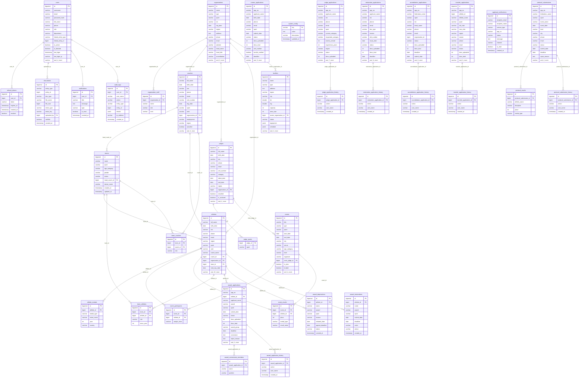

# ERD АИС eSport (PostgreSQL, генерация из Flyway-миграций V1-V16)

```mermaid
erDiagram
    users {
        bigserial id PK
        varchar username
        varchar email
        varchar password_hash
        varchar full_name
        varchar phone
        varchar role
        varchar department
        varchar linked_entity_type
        bigint linked_entity_id
        boolean is_active
        boolean is_blocked
        timestamp last_login
        varchar last_login_ip
        varchar _and_4_more_
    }
    refresh_tokens {
        bigserial id PK
        bigint user_id FK
        varchar token
        timestamp expires_at
        timestamp created_at
        boolean revoked
    }
    organizations {
        bigserial id PK
        varchar name
        varchar type
        varchar sport
        varchar inn
        date reg_date
        varchar region
        text address
        varchar phone
        varchar email
        varchar website
        varchar head_name
        varchar head_title
        varchar accreditation
        varchar _and_5_more_
    }
    organization_staff {
        bigserial id PK
        bigint organization_id FK
        varchar name
        varchar role
        varchar rank
    }
    coaches {
        bigserial id PK
        varchar full_name
        date birth_date
        varchar sex
        varchar phone
        varchar email
        varchar cert_number
        date reg_date
        varchar sport
        varchar rank
        bigint organization_id FK
        varchar employment
        varchar region
        boolean annulled
        varchar _and_4_more_
    }
    judges {
        bigserial id PK
        varchar full_name
        date birth_date
        varchar sex
        varchar phone
        varchar email
        varchar cert_number
        varchar category
        date attest_date
        date end_date
        varchar region
        bigint organization_id FK
        boolean annulled
        boolean is_archived
        varchar _and_2_more_
    }
    judge_sports {
        bigint judge_id FK
        varchar sport
    }
    teams {
        bigserial id PK
        varchar name
        varchar sport
        varchar age_category
        varchar gender
        varchar status
        bigint head_coach_id FK
        varchar doctor_name
        timestamp created_at
        timestamp updated_at
    }
    athletes {
        bigserial id PK
        varchar full_name
        date birth_date
        varchar sex
        varchar phone
        varchar email
        varchar region
        varchar sport
        varchar rank
        varchar coach_name
        bigint coach_id FK
        bigint organization_id FK
        bigint team_id FK
        date med_exp_date
        varchar _and_10_more_
    }
    athlete_medals {
        bigserial id PK
        bigint athlete_id FK
        varchar medal_type
        varchar event_name
        int year
        varchar country
    }
    events {
        bigserial id PK
        varchar title
        varchar type
        varchar sport
        date start_date
        date end_date
        varchar city
        varchar venue
        varchar age_category
        varchar level
        varchar organizer
        bigint main_judge_id FK
        boolean in_plan
        boolean funded
        varchar _and_4_more_
    }
    event_participants {
        bigserial id PK
        bigint event_id FK
        bigint athlete_id FK
        varchar weight_class
    }
    event_results {
        bigserial id PK
        bigint event_id FK
        bigint athlete_id FK
        int place
        varchar medal_type
        varchar result_value
    }
    facilities {
        bigserial id PK
        varchar name
        varchar type
        text address
        varchar region
        varchar city
        double lat
        double lng
        int capacity
        int area_sqm
        bigint owner_organization_id FK
        varchar status
        jsonb equipment
        jsonb schedule
        varchar _and_2_more_
    }
    team_athletes {
        bigserial id PK
        bigint team_id FK
        bigint athlete_id FK
        varchar role
        int since_year
    }
    team_coaches {
        bigserial id PK
        bigint team_id FK
        bigint coach_id FK
        varchar role
    }
    award_applications {
        bigserial id PK
        varchar app_no
        bigint athlete_id FK
        varchar applicant_name
        varchar award
        varchar sport
        date submit_date
        varchar status
        int docs_uploaded
        int docs_total
        varchar award_group
        date deadline
        text conclusion
        text reject_reason
        varchar _and_2_more_
    }
    award_commission_members {
        bigserial id PK
        bigint award_application_id FK
        varchar name
        varchar position
    }
    award_application_history {
        bigserial id PK
        bigint award_application_id FK
        varchar action
        varchar user_name
        timestamp created_at
    }
    award_deprivations {
        bigserial id PK
        bigint athlete_id FK
        varchar name
        varchar award
        varchar sport
        varchar reason
        date initiated_date
        date appeal_deadline
        varchar status
        timestamp created_at
    }
    award_restorations {
        bigserial id PK
        bigint athlete_id FK
        varchar name
        varchar award
        varchar sport
        date submit_date
        date deadline
        varchar votes
        varchar status
        timestamp created_at
    }
    trainer_applications {
        bigserial id PK
        varchar app_no
        varchar applicant_name
        date birth_date
        varchar phone
        varchar email
        varchar sport
        date submit_date
        varchar status
        int docs_uploaded
        int docs_total
        varchar cert_number
        boolean tunduk_verified
        date deadline
        varchar _and_5_more_
    }
    documents {
        bigserial id PK
        varchar entity_type
        bigint entity_id
        varchar doc_type
        varchar file_name
        bigint file_size
        varchar mime_type
        varchar minio_key
        bigint uploaded_by FK
        boolean verified
        timestamp created_at
    }
    notifications {
        bigserial id PK
        bigint user_id FK
        varchar title
        text message
        varchar type
        boolean is_read
        timestamp created_at
    }
    audit_logs {
        bigserial id PK
        bigint user_id FK
        varchar user_name
        varchar action
        varchar entity_type
        bigint entity_id
        jsonb details
        varchar ip_address
        timestamp created_at
    }
    system_config {
        varchar key PK
        text value
        varchar description
        timestamp updated_at
    }
    judge_applications {
        bigserial id PK
        varchar app_no
        varchar applicant_name
        varchar inn
        varchar phone
        varchar email
        varchar sport
        varchar current_category
        varchar requested_category
        int events_served
        int experience_years
        varchar region
        varchar status
        int docs_uploaded
        varchar _and_7_more_
    }
    judge_application_history {
        bigserial id PK
        bigint judge_application_id FK
        varchar action
        varchar user_name
        timestamp created_at
    }
    restoration_applications {
        bigserial id PK
        varchar app_no
        varchar applicant_name
        varchar inn
        varchar phone
        varchar email
        varchar doc_type
        varchar reason
        varchar old_number
        date issue_date
        varchar status
        int docs_uploaded
        int docs_total
        date deadline
        varchar _and_6_more_
    }
    restoration_application_history {
        bigserial id PK
        bigint restoration_application_id FK
        varchar action
        varchar user_name
        timestamp created_at
    }
    accreditation_applications {
        bigserial id PK
        varchar app_no
        varchar federation_name
        varchar sport
        varchar inn
        varchar head_name
        varchar phone
        varchar email
        bigint organization_id
        varchar status
        int docs_uploaded
        int docs_total
        date deadline
        date submit_date
        varchar _and_6_more_
    }
    accreditation_application_history {
        bigserial id PK
        bigint accreditation_application_id FK
        varchar action
        varchar user_name
        timestamp created_at
    }
    transfer_applications {
        bigserial id PK
        varchar app_no
        bigint athlete_id
        varchar athlete_name
        varchar sport
        varchar old_club
        varchar new_club
        varchar region
        varchar reason
        varchar phone
        varchar email
        varchar status
        int docs_uploaded
        int docs_total
        varchar _and_5_more_
    }
    transfer_application_history {
        bigserial id PK
        bigint transfer_application_id FK
        varchar action
        varchar user_name
        timestamp created_at
    }
    applicant_notifications {
        bigserial id PK
        varchar recipient_email
        varchar recipient_name
        varchar service_type
        varchar app_no
        varchar status
        text message
        varchar channel
        boolean is_read
        timestamp created_at
    }
    protocol_submissions {
        bigserial id PK
        varchar app_no
        varchar federation_name
        varchar sport
        varchar event_name
        date event_date
        varchar level
        varchar city
        varchar phone
        varchar email
        varchar status
        date submit_date
        date deadline
        text reject_reason
        varchar _and_2_more_
    }
    protocol_results {
        bigserial id PK
        bigint protocol_submission_id FK
        varchar athlete_name
        varchar discipline
        int place
        varchar medal_type
    }
    protocol_submission_history {
        bigserial id PK
        bigint protocol_submission_id FK
        varchar action
        varchar user_name
        timestamp created_at
    }
    users ||--o{ refresh_tokens : "user_id"
    organizations ||--o{ organization_staff : "organization_id"
    organizations ||--o{ coaches : "organization_id"
    organizations ||--o{ judges : "organization_id"
    judges ||--o{ judge_sports : "judge_id"
    coaches ||--o{ teams : "head_coach_id"
    coaches ||--o{ athletes : "coach_id"
    organizations ||--o{ athletes : "organization_id"
    teams ||--o{ athletes : "team_id"
    athletes ||--o{ athlete_medals : "athlete_id"
    judges ||--o{ events : "main_judge_id"
    events ||--o{ event_participants : "event_id"
    athletes ||--o{ event_participants : "athlete_id"
    events ||--o{ event_results : "event_id"
    athletes ||--o{ event_results : "athlete_id"
    organizations ||--o{ facilities : "owner_organization_id"
    teams ||--o{ team_athletes : "team_id"
    athletes ||--o{ team_athletes : "athlete_id"
    teams ||--o{ team_coaches : "team_id"
    coaches ||--o{ team_coaches : "coach_id"
    athletes ||--o{ award_applications : "athlete_id"
    award_applications ||--o{ award_commission_members : "award_application_id"
    award_applications ||--o{ award_application_history : "award_application_id"
    athletes ||--o{ award_deprivations : "athlete_id"
    athletes ||--o{ award_restorations : "athlete_id"
    users ||--o{ documents : "uploaded_by"
    users ||--o{ notifications : "user_id"
    users ||--o{ audit_logs : "user_id"
    judge_applications ||--o{ judge_application_history : "judge_application_id"
    restoration_applications ||--o{ restoration_application_history : "restoration_application_id"
    accreditation_applications ||--o{ accreditation_application_history : "accreditation_application_id"
    transfer_applications ||--o{ transfer_application_history : "transfer_application_id"
    protocol_submissions ||--o{ protocol_results : "protocol_submission_id"
    protocol_submissions ||--o{ protocol_submission_history : "protocol_submission_id"
```